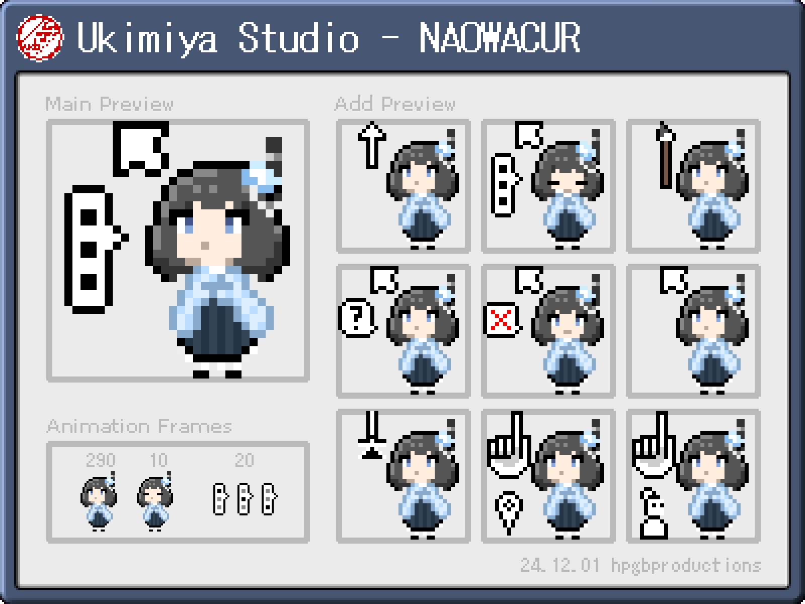

### Folders

- **32:** Source images (32px)
- **ani:** Chibi animated cursors (32px)
- **arrows32:** Standard arrow cursors (32px)
- **arrows64:** Half-scale arrow cursors for use with larger cursor scales (64px)
- **chara64:** Chibi static cursors (64px)
- **img:** Thumbnail resources

### 32px/Animated Installation Type

Recommended for low resolution displays.

- Download the folders `ani` and `arrows32`.
- Go to the Mouse Properties menu: Search Mouse Settings, then Additional mouse settings > Pointers
- Assign the pointers

### 64px/Static Installation Type

Recommended for high resolution displays.

- Download the folders `arrows64` and `chara64`.
- Go to mouse accessibility settings: Settings > Accessibility > Mouse pointer and touch
- Double the cursor scale by changing the size from 1 to 3. (Each notch increases the scale by 50%)
- Go to the Mouse Properties menu: Search Mouse Settings, then Additional mouse settings > Pointers
- Assign the pointers
